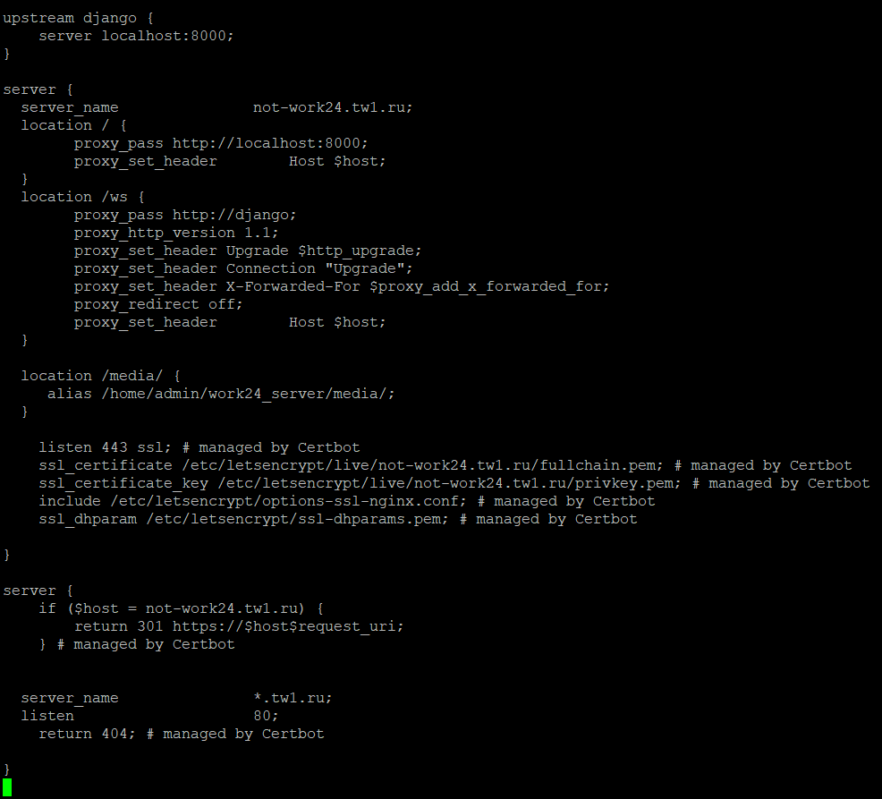

# Лабораторная работа №1

## Цель:

**Настроить nginx по заданному тз:**

1. Должен работать по https c сертификатом
2. Настроить принудительное перенаправление HTTP-запросов (порт 80) на HTTPS (порт 443) для обеспечения безопасного
   соединения.
3. Использовать alias для создания псевдонимов путей к файлам или каталогам на сервере.
4. Настроить виртуальные хосты для обслуживания нескольких доменных имен на одном сервере.
5. Что угодно еще под требования проекта

**Результат:**

Предположим, что у вас есть два пет проекта на одном сервере, которые должны быть доступны по https. Настроенный вами
веб сервер умеет работать по https, относить нужный запрос к нужному проекту, переопределять пути исходя из требований
пет проектов.
В качестве пет проектов можете использовать что-то свое, можете что-то опенсорсное, можете просто код из трех строчек
как например здесь

**Важно:**

В этой лабе прошу вас не углубляться в безопасность nginx, тк так будет интереснее делать лабу со звездочкой)

## Выполнение

### Введение

Для выполнения задания используется тестовый сервер с размещенной CRM строительной компании.
Проект написан на Python с использованием фреймворка Django.

Проект размещен на облачном сервере с ОС Ubuntu.

**Нюансы проекта:**

1. Для веб-сокетов используется бибилиотека channels
2. Для asgi используется Daphne

### 1. Исходное состояние сервера
Изначальная конфигурация тестового сервера (работает только на http)

Сайт запущен, работает и доступен по http, что видно на рисунке ниже

### 2. Установка SSL-сертификата

Для установки Let's Encrypt SSL-сертификата на сервер использовался Certbot, установленный с помощью команды:

`sudo apt install certbot python3-certbot-nginx`

Проверяем настройки брандмауэра, он должен пропускать http и https трафик

Получаем сертификат с помощью команды:

`sudo certbot --nginx -d not-work24.tw1.ru`

Добавление автообновления сертификатов происходит посредством команд:

`crontab -e`

В файл с крон-работы добавляется запись:

`30 3 * * 2 /usr/bin/certbot renew >> /var/log/renew-ssl.log`

Конфигурация NGINX после подключения сертификата:

На конфигурации виден 301 редирект на https и alias, который используется для файлов media

Проверка работы сайта:

На прод-сервере конфигурация с wildcard Let's Encrypt сертификатом

## Часть со звездочкой

Для части со звездочкой тестировался сайт https://not-autosender.ru/ - копия действующего сайта

### HTTP Smuggling 

Первая уязвимость, на которую проверен сайт, запущенный на NGINX – HTTP Smuggling 
Для проверки на уязвимость отправляются запросы с конфликтующими заголовками, например Content-Length и Transfer-Encoding: chunked. 
Первый запрос представлен на рисунке

На используемый URL не разрешен метод POST. Для еще одного теста был найден POST-запрос в логах браузера
и на него отправлен запрос с конфликтующими заголовками.

Отправка POST-запроса на валидный URL с данными формата text выдало ошибку SQL

Данные в формате JSON не вызвали никаких ошибок, вернули статус 200

Также была выполнена проверка с помощью Burp Suit. Сервер вернул Request Timeout

Уязвимость HTTP Smuggling не обнаружена

## XSS (Cross-Site Scripting) 

XSS (Cross-Site Scripting) — это уязвимость, которая позволяет злоумышленникам внедрять и 
исполнять вредоносные скрипты в браузере других пользователей. Если сервер неправильно обрабатывает и отображает пользовательский 
ввод (например, поисковые запросы, формы обратной связи и т.д.), злоумышленник может внедрить вредоносный код (например,
JavaScript) в ответ, который выполнится у других пользователей при просмотре страницы.

Попытка вместо значения подставить скрипт не привел к выполнению скрипта на странице несмотря на отображение без экранирования.
Из этого следует, что сервер защищен от атак типа XSS 

## Уязвимость из-за отсутствия заголовков безопасности
тсутствие важнейших заголовков безопасности, таких как X-Content-Type-Options, X-Frame-Options или Strict-Transport-Security, может сделать сервер уязвимым к ряду атак

Проверить данную уязвимость можно посредством сайта SecurityHeaders (https://securityheaders.com/)

Сайт уязвим, так как не проверяет наличие заголовков безопасности
