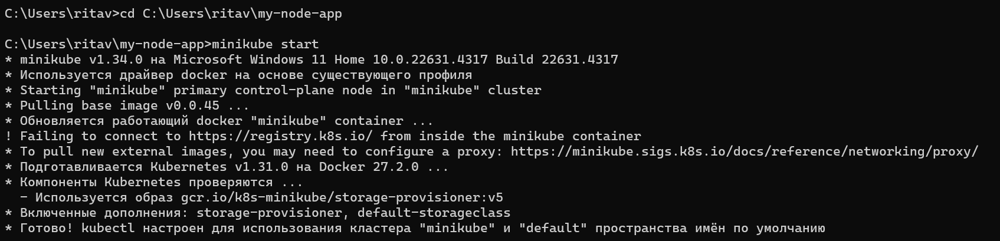
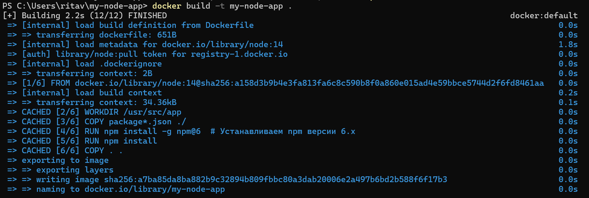
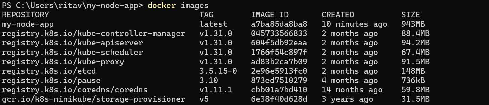
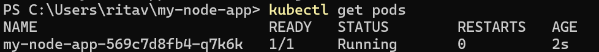
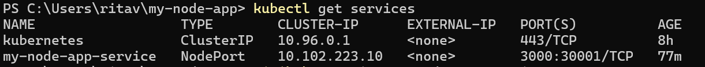
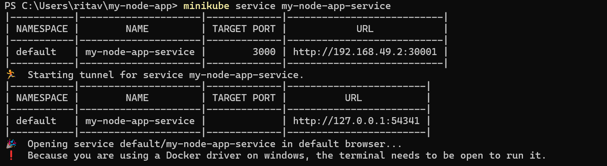
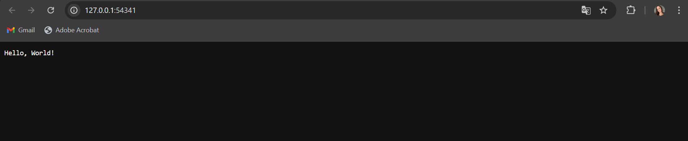

# Лабораторная работа №3

## Цель

Поднять kubernetes кластер локально (minikube), в нём развернуть свой сервис, используя 2-3 ресурса kubernetes кодом из yaml файлов одной командой запуска. Показать работоспособность сервиса.

## Выполнение

### Скачивание и установка minikube

Для запуска Kubernetes будем использовать minikube, он легко запускает одноузловой кластер Kubernetes внутри виртуальной машины на нашем компьютере.

Поэтому первое, что нам потребуется — это установить minikube. Для этого перейдем на сайт https://kubernetes.io/ru/docs/tasks/tools/install-minikube/ и, следуя всем шагам, скачаем и установим minikube.

### Запуск minikube

Чтобы преверить, что всё было установлено и работает, запустим minikube в командной строке командой:
```
minikube start
```
Результат команды на рисунке ниже.



Команда minikube start создает контекст kubectl под именем "minikube". Этот контекст содержит конфигурацию для взаимодействия с кластером minikube. Minikube автоматически устанавливает этот контекст.
Minikube также выбрал гипервизор Docker автоматически и это нам подходит для дальнейшего выполнения работы (предварительно уже был установлен и запущен Docker Desktop).

После запуска minikube проверим статус кластера командой:
```
minikube status
```
Вывод:
```
minikube status
minikube
type: Control Plane
host: Running
kubelet: Running
apiserver: Running
kubeconfig: Configured
```
Как видим, кластер успешно запущен и работает!

### Развертывание сервиса

Далее создадим сервис, который выводит “Hello, World!” в браузер, потому что таким способом мы ещё не здоровались с миром))

В папке my-node-app пердставлены все файлы, которые будут использованы далее. 
Певый необходимый нам файл называется server.js, он запускает простой сервер:

```
const http = require('http');

const server = http.createServer((req, res) => {
  res.statusCode = 200;
  res.setHeader('Content-Type', 'text/plain');
  res.end('Hello, World!\n');
});
const PORT = 3000;
server.listen(PORT, () => {
  console.log(`Сервер запущен на http://localhost:${PORT}`);
});
```

Теперь у нас есть сервер на Node.js, который мы будем разворачивать. И для этого:

1. Создадим Dockerfile в папке с проектом (my-node-app).

   ```
   # Базовый образ
    FROM node:14
    
    # Указываем рабочую директорию
    WORKDIR /usr/src/app
    
    # Копируем package.json и package-lock.json в контейнер
    COPY package*.json ./
    
    # Установка совместимой версии npm
    RUN npm install -g npm@6  # Устанавливаем npm версии 6.x
    
    # Установка зависимостей
    RUN npm install
    
    # Копируем все файлы приложения в контейнер
    COPY . .
    
    # Команда по умолчанию
    CMD ["npm", "start"]
   ```

2. Соберем образ Docker, выполнив команду из директории проекта в командной строке:
   
   ```
   docker build -t my-node-app .
   ```

   

3. Пока образ собирается пойдем писать yaml-файл. Для развертывания сервиса нам достаточно использова 2 ресурса kubernetes: Service и Deployment, которые мы создадим в yaml-файле all.yaml:
   
   ```
    apiVersion: apps/v1
    kind: Deployment
    metadata:
      name: my-node-app
    spec:
      replicas: 1
      selector:
        matchLabels:
          app: my-node-app
      template:
        metadata:
          labels:
            app: my-node-app
        spec:
          containers:
          - name: my-node-app
            image: my-node-app:latest
            imagePullPolicy: Never
            ports:
            - containerPort: 3000
    
    ---
    apiVersion: v1
    kind: Service
    metadata:
      name: my-node-app-service
    spec:
      type: NodePort
      selector:
        app: my-node-app
      ports:
        - port: 3000
          targetPort: 3000
          nodePort: 30001
   ```
   
4. Проверим, что образ доступен:
   
   ```
   docker images
   ```
   
   
5. И после этого применим наш манифест:

   ```
   kubectl apply -f all.yaml
   ```

6. Проверим теперь статус подов и сервисов

   

   

   иии... о чудо всё запустилось! Статус Running. Деплоймент и сервис настроены, так как поды запущены.
  
    ps. я очень долго пыталась исправить ошибку статуса ImagePullBackOff у пода.
    Как я выяснила, эта ошибка возникает потому, что Kubernetes не может найти образ my-node-app в реестре Docker. 
    И перебрав все способы решения, исправить её мне помогло добавление параметра imagePullPolicy: Never в манифест деплоймента, 
    чтобы указать, что Kubernetes должен использовать локальный образ и не пытаться его загружать из Docker Hub или других реестров.

7. Дальше открываем сервис

   ```
   minikube service my-node-app-service
   ```
   
   
  
### Работоспособность сервиса

Наш сервер теперь доступен в браузере, minikube создал туннель для проброса порта.



## Вывод 

В ходе данной работы мы подняли kubernetes кластер локально (minikube), в нём развернули свой сервис, используя 2 ресурса kubernetes кодом из yaml файлов одной командой запуска. 
И показали работоспособность сервиса.

Не сдавайтесь! Если долго мучаться, что-нибудь получится!
