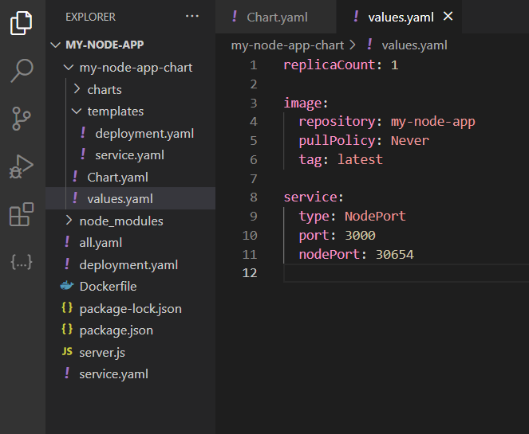

# Лабораторная работа №3 (со звездочкой)

## Цель

Изучить принцип работы helm chart.

## Задачи
1. Создать helm chart на основе обычной 3 лабы.
2. Задеплоить его в кластер.
3. Поменять что-то в сервисе, задеплоить новую версию при помощи апгрейда релиза.

## Выполнение

Helm Chart - это пакет, содержащий все необходимые ресурсы, настройки и шаблоны для развёртывания приложения в виде единого логического юнита.

Helm Chart используется в диспетчере пакетов для Kubernetes и упрощает процесс установки, управления и масштабирования приложений в кластере.

### Создание

Создадим Helm Chart в каталоге проекта, созданного в обычной 3 лабораторной, с помощью команды:

```
 helm install my-node-app-release ./my-node-app-chart
```


В каталоге проекта появится новая папка my-node-app-chart, содержащая основные компоненты:
1. Chart.yaml - содержит метаданные приложения (имя, версию, зависимости и т. д.).
2. Values.yaml - определяет конфигурационные параметры, которые можно переопределить во время установки или обновления чарта.
3. Директория с шаблонами - в ней находятся шаблоны, которые комбинируются с установленными значениями для создания манифестов.
4. Директория для подчартов - если приложение требует другие чарты для своей работы, они размещаются здесь.

### Настройка основных компонентов

Чтобы не запутаться в количестве автоматически созданных файлов в папке my-node-app-chart, удалим всё что не будет использоваться 
и оставим только Chart.yaml, Values.yaml, директорию с шаблонами - templates (в ней нам нужны будут только deployment.yaml и service.yaml). 
В этих файлах мы также удалим все ненужное для нашего проекта (комментарии и тд). 

Получившиеся файлы представлены на рисунках ниже.

Chart.yaml


Values.yaml - зададим параметры (образ, порты), которые затем будем использовать в шаблонах.



Настроим шаблоны deployment.yaml и service.yaml с использованием контекстов .Release (содержит информацию о текущем релизе Helm.) 
и .Values (содержит значения, определенные в файле values.yaml Helm чарта.).


### Деплой чарта в кластер

Для деплоя выполним команду:

```
helm install my-node-app-release ./my-node-app-chart
```


Далее проверим, что поды и сервисы успешно созданы:


### Обновление чарта

Поменяем, например, количество подов (replicaCount) и порт (nodePort)


После внесения изменений, выполним команду для обновления релиза:

```
helm upgrade my-node-app-release ./my-node-app-chart

```


Снова проверим состояние подов и сервисов и увидим новый порт, а также, что появился ещё один под.


### Работоспособность сервиса

Пороверим, что наш сервис по-прежнему пишет Hello Wordl! в браузере.

Получим URL нашего сервиса помощью команды: 

```
 minikube service my-node-app-release-service --url
```


## Вывод 

В ходе данной работы мы создали helm chart на основе обычной 3 лабы, дальше задеплоили его в кластер.
Поменяли количество подов (replicaCount) и порт (nodePort) и научились деплоить новую версию при помощи апгрейда релиза.

Преимущества использования Helm по сравнению с классическими манифестами:
1. Визуальное наслаждение и порядок. Каждый чарт имеет установленную структуру (папки templates, charts, values.yaml и др). 
2. Создание манифестов с использованием переменных. Это позволяет легко изменять значения
(например, порты, количество реплик, конфигурацию) через файл values.yaml без необходимости изменять сами манифесты.
3. Удобное и быстрое обновление/откатывание релиза до определенной версии, что недоступно при использовании стандартных манифестов.
