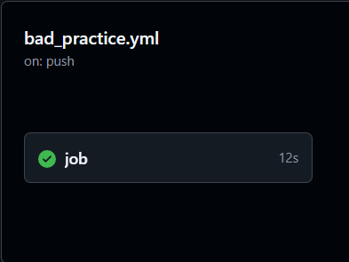
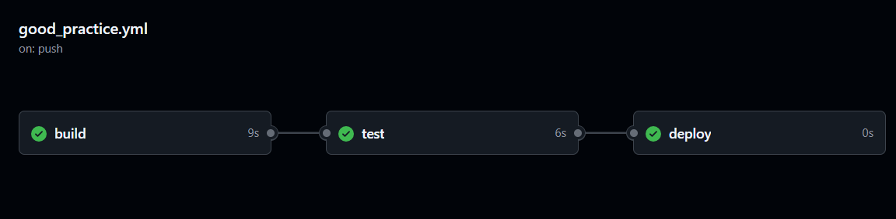
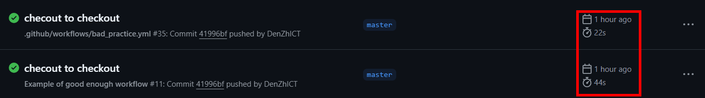
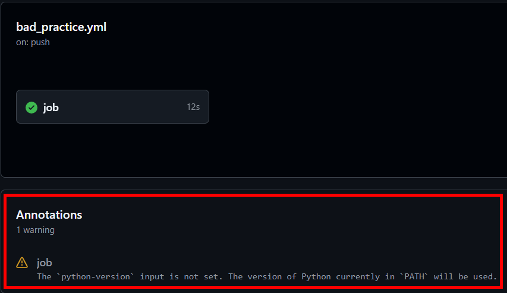

# 4 лабораторная работа "CI/CD" - обычная часть

## Задание

1. Написать “плохой” CI/CD файл, который работает, но в нем есть не менее пяти плохих практик по написанию CI/CD
2. Написать “хороший” CI/CD, в котором все плохие практики исправлены
3. Указать, как были исправлены плохие практики на хорошие, сравнить полученный результат

## Ход работы

### Начальное построение

Для данной работы был выбран способ построения CI/CD через Github Action.

Я уже работал с Jenkins для автоматизации тестирования на Java, однако:

1. Никогда не работал с ним для организации CI/CD
2. Github Action является сейчас более распространяемым и популярным способом
3. Хотелось попробовать что-то новое - это никогда не бывает плохой идеей

Итак, первый делом был создан отдельный репозиторий для работы с Github Action, я никогда с ним не работал и мог что-то наломать так что, чтобы никому не мешать был создан отдельный репозиторий, с не очень оригинальным названием:
* https://github.com/DenZhICT/git_action_test_rep.git

В разделе Action был создан Simple Workflow от Github:

```yml
# This is a basic workflow to help you get started with Actions

name: CI

# Controls when the workflow will run
on:
# Triggers the workflow on push or pull request events but only for the "master" branch
push:
  branches: [ "master" ]
pull_request:
  branches: [ "master" ]

# Allows you to run this workflow manually from the Actions tab
workflow_dispatch:

# A workflow run is made up of one or more jobs that can run sequentially or in parallel
jobs:
# This workflow contains a single job called "build"
  build:
# The type of runner that the job will run on
    runs-on: ubuntu-latest
    # Steps represent a sequence of tasks that will be executed as part of the job
    steps:
      # Checks-out your repository under $GITHUB_WORKSPACE, so your job can access it
      - uses: actions/checkout@v4

      # Runs a single command using the runners shell
      - name: Run a one-line script
        run: echo Hello, world!

      # Runs a set of commands using the runners shell
      - name: Run a multi-line script
        run: |
          echo Add other actions to build,
          echo test, and deploy your project.
```
Неплохой workflow, который может показать новичку основы и основные структуры для написания своего workflow.

### Плохая практика
Игнорирую всё, что было написано в простом workflow, создаём плохой CI/CD - злодей:
``` yml
on:
  push:
    branches:
      '*'
jobs:
  job:
    runs-on: ubuntu-latest
    steps:
      - name: first step
        run: |
          echo Building the project on Ununtu latest...
          echo Project was built!
      - name: second step
        run: |
          echo Testing the project...
          echo Use login: admin
          echo Use password: admin
          echo Project was tested!
      - name: third step
        run: |
          echo Deploying the project...
          echo Project was deployed!
```

Даже на такой до ужаса простом примере, который использует лишь установку образа Ubuntu и выполняет команды echo, можно указать на множество проблем. Однако данный пример показался совсем не показательным, поэтому было принято решение немного его усложнить:
<details>

<summary>Был создан простейший сервер на Python</summary>

```python
import socket

server = socket.socket(socket.AF_INET, socket.SOCK_STREAM)

server.bind(('localhost', 6565))
server.listen(1)

con, adr = server.accept()
data = con.recv(1024)
con.send(data)
con.close()

server.close()
```
Просто создаётся прослушивающий сервер, получает одно сообщение, отсылает его обратно и отрубается.
> P.S.
> 
> Знаю пример ужасный, но живого примера нет, я особо не программист, это всё на что меня хватило.
</details>
<details>

<summary>Был создан простой, но странный тест</summary>

```python
import socket
import subprocess
import os
import time

def test_env_password():
    assert os.environ['INPUT_PASSWORD'] == 'admin'

def test_connection():
    subprocess.Popen(["python", "./project/src/server.py"])

    time.sleep(1)

    client = socket.socket()
    client.connect(('localhost', 6565))

    message = "Massage123!"
    client.send(message.encode())
    data = client.recv(1024)
    
    assert data.decode() == message
```
Первый тест проверяет установлен ли определённый пароль, а второй запускает сервер и проверяет его работу.
> P.S.
> 
> Никогда так не делайте тесты, эта штука сделана на абсолютных костылях: переменная окружения была взята так как в pytest нельзя прокинуть нормально значения внутрь, а сон на 1 секунду сделан, потому что без него тест падает, так как сервер не успевает запуститься.

</details>

Для данного ПроЕКта был создан более ПродВИнУТый workflow:
```yml
on:
  push:
    branches:
      '*'
jobs:
  job:
    runs-on: ubuntu-latest
    steps:
      - uses: actions/checkout@v4
      - uses: actions/setup-python@v5
      - name: first step
        run: pip install pytest
      - name: second step
        run: INPUT_PASSWORD="password" pytest ./project/test/test_server.py
      - name: third step
        run: |
          echo Deploying the project...
          echo Project was deployed!
```
Уже плохая практика стала поинтереснее, но менее плохой она не стала, попробуем это исправить!
>P.S.
> 
> Деплоить я не умею, поэтому оставим просто текстик...

### Хорошая практика

Немного посидев и подумав, я смог прийти к вот такому неплохому CI/CD:

```yml
name: Example of good enough workflow

on:
  push:
    branches: 
      'master'
  pull_request:
    branches:
      'master'

env:
  python_version: '3.12'

jobs:

  build:
    runs-on: ubuntu-latest
    env:
      server_path: ./project/src/server.py
    steps:
      - name: Checkout repository
        uses: actions/checkout@v4
      - name: Setup Python ${{env.python_version}}
        uses: actions/setup-python@v5
        with:
          python-version: ${{env.python_version}}
      - name: Build server
        run: python $server_path &
  
  test:
    needs: build
    runs-on: ubuntu-latest
    env:
        test_path: ./project/test/test_server.py
        requirements_path: ./requirements.txt
    steps:
      - name: Checkout repository
        uses: actions/checkout@v4
      - name: Setup Python ${{env.python_version}}
        uses: actions/setup-python@v5
        with:
          python-version: ${{env.python_version}}
      - name: Setup needed environment
        run: pip install -r $requirements_path
      - name: Testing server
        run: INPUT_PASSWORD=${{secrets.SERVER_TEST_PASSWORD}} pytest $test_path
          
  deploy:
    needs: test
    runs-on: ubuntu-latest
    steps:
      - name: Project deployment
        run: |
          echo Deploying the project...
          echo Project was deployed!
```
Хоть и неидеально, но уже лучше, чем было!

### Обзор исправлений
Теперь можно и разобрать, что же такого изменилось.

1. `Плохое именование`
<details>

<summary>Плохая практика</summary>

```yml
- name: first step
```

</details>
<details>

<summary>Хорошая практика</summary>

```yml
- name: Checkout repository
```

</details>
Использование имён в целом и использование хорошо описывающих имён крайне упрощает чтения как кода, так как ты можешь понять, что за непонятные строчки кода запускаются строчкой ниже, а также позволяет сделать более красивый и понятный вывод в разделе Action, сравним два варианта: <br/>


Как видно в плохой практике указан лишь путь и название самого файла, которое зачастую может ничего не говорить, а на хорошей практике указано красивое название. Вот ещё пример: <br/>

 

На первой фотографии невозможно понять, что происходит внутри шага пока в этот шаг не зайти, что неудобно. На втором фото можно, лишь посмотрев на названия, догадаться, что происходит внутри, а если какой-то шаг выдаст ошибку догадаться, что могло пойти не так.
2. `Реализация на всех ветках`
<details>

<summary>Плохая практика</summary>

```yml
on:
  push:
    branches:
      '*'
```

</details>
<details>

<summary>Хорошая практика</summary>

```yml
on:
  push:
    branches: 
      'master'
  pull_request:
    branches:
      'master'
```

</details>
Реализация на всех ветках не есть хорошо. В данном репозитории всего одна ветка, однако на крупном проекте будет множество веток, который могут обновляться каждые десять минут, и при каждом пуше будет запускаться action, что создаст ненужную бесконечную очередь из action`ов и может привести к срабатыванию ненужного кода, например, выпустить недоработанный продукт в релиз. Поэтому следует с осторожностью подходить к выбору веток и директорий при действиях, с которыми стоит запускать action.

3. `Не использование переменных`
<details>

<summary>Плохая практика</summary>

```yml
run: INPUT_PASSWORD="admin" pytest ./project/test/test_server.py
```

</details>
<details>

<summary>Хорошая практика</summary>

```yml
env:
        test_path: ./project/test/test_server.py
run: INPUT_PASSWORD=${{secrets.SERVER_TEST_PASSWORD}} pytest $test_path
```

</details>
При написании workflow можно создавать переменные как нп уровне всего workflow, так и на уровне одной работы. Не стоит недооценивать возможности переменных, они позволяют не только упростить редактирование кода, путём изменения кода в одной строчке вместо десяти, но и делает код более читаемым при использовании переменных с понятными названиями.

4. `Отсутсвия разделения на этапы`
<details>

<summary>Плохая практика</summary>

```yml
jobs:
  job:
```

</details>
<details>

<summary>Хорошая практика</summary>

```yml
jobs:
  build:
  test:
  deploy:
```

</details>
Создание нескольких отдельных работ позволят не только сделать красивый и удобный для понимая вывод, получая не это уродливое что-то: <br/>



А вот такую красивую цепочку: <br/>



Но и также позволяет использовать дополнительные возможности по типу запуск определённых работы при определённых условиях.

> P.S
> 
> Надо быть осторожным с их количество, так как при каждом шаге виртуальная машина в Git перезапускается и приходится заново создавать окружение. Благодаря этому, время прохождение action увеличилось в два раза: <br/>
> 
5. `Не использование action'ов`
<details>

<summary>Плохая практика</summary>

```yml
steps:
  - name: first step
```

</details>
<details>

<summary>Хорошая практика</summary>

```yml
steps:
  - uses: actions/checkout@v4
  - uses: actions/setup-python@v5
  - name: first step
```

</details>
Данная плохая практика была ликвидирована ещё на этапе перехода от одной плохой практики к другой. По своей сути Actions являются модулями, который в себе имеют код, подключая которые ты получаешь желаемый результат. Это полезно, так как не заставляет перепридумывать велосипед, например при checkout`е репозитория внутрь виртуальной машины или установки Python. Это модульность, которая позволяет самому создавать свои собственные action и добавлять их в свои проект.

6. `Использование случайной версии`
<details>

<summary>Плохая практика</summary>

```yml
- uses: actions/setup-python@v5
```

</details>
<details>

<summary>Хорошая практика</summary>

```yml
uses: actions/setup-python@v5
with:
  python-version: ${{env.python_version}}
```

</details>
При использовании случайной доступной версии могут возникать проблемы работы приложений, так как разработчики могут менять функционал версия от версии, и программа, которая запускается на одной версии на другой сломается. Также может быть подгружен нестабильная версия, что тоже нехорошо.

На неиспользование прямого указания версии, как плохой практики, указывает сам Git Action: <br/>



7. `Использование избыточных действий`
<details>

<summary>Плохая практика</summary>

```yml
run: pip install pytest
```

</details>
<details>

<summary>Хорошая практика</summary>

```yml
run: pip install -r $requirements_path
```

</details>
В данном примере не совсем понятно, что имеется ввиду, но позвольте объяснить:

Сейчас скачивается один модуль для Python. Отлично! Это было написано в плохой практике.

Но допусти нужно установить два модуля, что тогда будете делать? Можно написать ```run: |```, а дальше укажите два pip`а. Отлично!

Однако, если таких модулей будет три, пять, десять, сто? Прописывать такое количество сделает не только данный этап крайне длинный с точки зрения кода, так и ещё сделает проблемным его редактирование.

Поэтому, если есть возможность добиться одной и той же цели с меньшим количество действий - пользуйтесь ею. Краткость и лаконичность помощник любого программиста!

8. `Хардкод секретов`
<details>

<summary>Плохая практика</summary>

```yml
INPUT_PASSWORD="admin"
```

</details>
<details>

<summary>Хорошая практика</summary>

```yml
INPUT_PASSWORD=${{secrets.SERVER_TEST_PASSWORD}}
```

</details>
Хардкорная вставка каких-либо элементов мы уже назвали плохой практикой. Однако вставка секретных данных - это уже прямое нарушение информационной безопасности. В Git Action есть возможность создавать специальный переменные репозитория - секреты. Это убережён данный от хардкорной записи, а также вывода в логах работы самого action`а.

> P.S.
> 
> Использование секретов от Github в репозитории считается не самым безопасным действием по ряду причин, однако если других вариантов нет, то... на безрыбье и рак рыба!

9. `Отсутсвие зависимого запуска`
<details>

<summary>Плохая практика</summary>

```yml
- name: fourth step
  run: |
    echo Deploying the project...
```

</details>
<details>

<summary>Хорошая практика</summary>

```yml
deploy:
  needs: test
  runs-on: ubuntu-latest
```

</details>
В Git Action все работы могут запускаться параллельно, что ускоряет работу работ (жёсткая тавтология), однако не всегда это хорошо. Например, запуск релиза приложения без корректного прохождения тестов не имеет смысла, так как иначе будет выложена заведомо нерабочая версия - думаю, это не понравится пользователям. Поэтому создания зависимостей и условий запуска поможет экономить время, деньги и нервы.

## Вывод:

В ходе выполнения лабораторной работы удалось познакомиться с Git Action, узнать его основные структуры и возможности. Также был написан workflow с набором плохих практик, которых следует избегать при написании кода, а после все эти практики были заменены на хороший, крутые, милые практики, который стоит использовать и чем чаще, тем лучше!