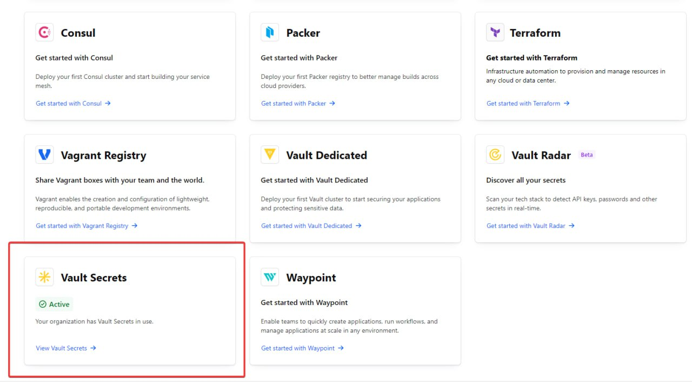

# 4 лабораторная работа "CI/CD" - звёздная часть

## Задание

Организовать красивую работу с секретами, где CI/CD пайплайн будет сам забирать секреты из Hashicorp Vault и использовать их, не светя значениями в логах. 

## Ход работы

### Проблемы секретов от Git

Обычно не рекомендуется использовать секреты в Git для сокрытия данных в Git Action по ряду причин:

1. Небезопасность. Секреты Git, как и любой другой механизм хранения секретов в репозитории, не предназначен для длительного хранения чувствительной информации. Если человек получает доступ к репозиторию, как её владелец или обладатель высоких прав, то все секреты станут доступны злоумышленнику.
2. История изменений. Git хранит историю всех изменений. Даже если вы удалите секреты из репозитория, они будут доступны в истории изменений и могут быть восстановлены специальными инструментами.
3. Доступность всем участникам. Все члены команды, имеющие доступ к репозиторию, смогут видеть секреты в Git, а значит недобросовестный член команды может слить данные. 
4. Сложность управления. Секреты Git не предоставляют возможности для управления доступом к секретам, установки сроков действия и многим другим инструментам.
5. Децентрализованность. Каждый из секретов будет привязан к своему репозиторию, и не сможет быть использован где-то ещё, а также при удалении или потери репозитория, все секреты нужно будет восстанавливать заново.
6. Логирование секретов. Git не предоставляет информации о пользовании секретами: открытии, использовании, изменении и прочему, что важно для отслеживания возможного внедрения злоумышленника.

По данным причинам, Git Secret можно использовать для личных целей и тестовых начальных вариантов разработки, однако выходить с ним в крупную производственную среду. Для этого обычно используются другие сервисы, например Hashicorp Vault, который будет использоваться в данной работе.

### Начальные десять часов страданий

Первые шесть часов были посвящены запуску Hashicorp Vault серверу.

Сначала была идея запустить его на операционной системе Windows. При учёте не заточенность этого сервера под Windows, а также ухода Hashicorp из России, сделать это было нелегко. Перепробовав все возможные способы, указанные в интернете, "нелёгкость" превратилась в невозможность.

По итогу сервер был запущен локально на Docker. Был использован метод JWT для получения доступа к секретам, настроен JWT для работы с доверительным отношением к OIDC для Git, создан секрет, создана роль и права для этой роли - всё было отлично! Потом был написан код для получения секретов c круто настроенным hashicorp/vault-action, чтобы получить секрет, и...

И тут пришло великое осознание, что сервер запущен локально, на устройстве, а Git Action запускается где-то там, на этой планете, и не может получить доступ к локальному серверу, а значит всё было бесполезно..!

После десяти часов работы, без еды, воды и отдыха, был сделан трюк с табуреткой и петлёй, после чего я отвисал всю ночь напролёт дома.

### Решение проблемы

На следующее утро был собран консилиум из моего духа, демон, который завладел моим телом и решил закончить данную лабораторную работу, и моя шизофрения. Каждый выдал свой вариант решения проблемы:

Дух предложил запустить сервер не локально, а на белом адресе в Интернет.

Демон сказал, что можно организовать SSH доступ к компьютеру через сеть, а после организовать её и коде Git Action.

Шизофрения же в адской агонии безумия вскричала: "Найди! НАЙДИ! и отыщи онлайн-сервис от Hashicorp Vault - он существует, к нему будет доступ!"

Собравшись с духом демон взвесил все за и против и понял, что шизофрения была как всегда права, и данный вариант был принят в разработку.

У Hashicorp Vault есть облачная платформа для организации работы с секретами, причём она буквально называется Hashicorp Cloud Platform или просто HCP:

* Из плюсов: легко, понятно, классно можно молодёжно!
* Из минусов: так Hashicorp ушла из России, то доступ к ней можно получить только по трём буквам.

Но минус не значительный, так как на данный момент все в России сидят на трёх буквах из-за "замедления" Youtube и отключения Discord. Поэтому VPN мне в помощь и пошли работать!

### Создание хранилища

Была проведена регистрация и была создана организация: <br/>


Внутри организации был создан проект: <br/>


Внутри проекта было создано приложение: <br/>


Внутри приложения был произведён переход в раздел хранилища секретов: <br/>



Внутри хранилища был создан секрет с названием VAULT_SECRET и значением admin: <br/>


> P.S.
> 
> Стоит отметить, что у HCP существует достаточно полезная документация, вырезки из которой можно увидеть и на самом сайте  <br/>
>
> 

Была создана роль "Сервиса" (Service principal), который обладает правами на чтения секретов (и не больше): <br/>


У данной роли существует специальный ключ доступа, состоящий из ID и SECRET, который показывается единожды, поэтому его надо было где-то сохранить: <br/>


Всё было успешно и красиво создано, перейдём к этапу интеграции данного секрета в Git Action.

### Возможность синхронизации

У HCP есть возможность синхронизации секретов с секретами Git, в одностороннем порядке (т.е. из Vault в Git - окей, из Git в Vault - нет): <br/>


Как видно из фото ниже, появился новый секрет, который создан Vault: <br/>


После чего мы можем использовать данный секрет из Vault, как обычный секрет Git... то есть по своей сути все проблемы Git секретов при данном варианте организации процессов сохраняет все свои недостатки, разве что может автоматически получить секреты из хранилища секретов.

> P.S.
> 
> Да, при синхронизации секретов хранилище даже не ведёт логирование использования секретов, так как секрет полностью попадает под юрисдикцию Git, поэтому, если кто-то узнает значение секрета, об это невозможно будет никак узнать, пока вся система уже не будет взломана :)

Вывод: Вариант не очень хороший - ищём более подходящий!

### Организация получения секрета

Для получения данных из HCP была использована возможность взаимодействия через CLI и тот ключ для роли, который был записан в виде двух переменных в секретах Git: <br/>


> P.S.
> 
> Здесь читатель может задать вопрос, а какой смысл использовать данный способ, если по сути мы меняем прямое хранение данных в секретах Git, на хранение ключей от роли с доступом к этим данным?
> 
> Ну, во-первых, любое использование данного ключа будет логироваться в системе хранилище - это уже здорово.
> 
> Во-вторых, данный ключ для одной роли можно удалять и пересоздавать когда угодно и сколько угодно раз. При этом эти же части ключей можно сохранять, как секреты хранилища, а после синхронизировать с Git.
> То есть по своей сути всё весело автоматизировать, можно хоть каждую минуту пересоздавать ключ для роли, обновлять значения ключа в хранилище, а затем синхронизировать с Git, чтобы, даже если кто-то этот ключ украдёт, он уже не имел смысла при ближайшем использовании.

Для установки HCP на Ubuntu нужно использовать следующий набор команд:

```yml
name: Setup HCP
run: |
  sudo apt-get update &&
  sudo apt-get install gpg coreutils
  curl -fsSL https://apt.releases.hashicorp.com/gpg | sudo gpg --dearmor -o /usr/share/keyrings/hashicorp-archive-keyring.gpg
  echo "deb [signed-by=/usr/share/keyrings/hashicorp-archive-keyring.gpg] https://apt.releases.hashicorp.com $(lsb_release -cs) main" | sudo tee /etc/apt/sources.list.d/hashicorp.list
  sudo apt update && sudo apt install hcp -y
```

Для получения же ключа, сначала нужно подключиться к приложению использую ключ роли, а после сохранить в переменную среды Git, которая будет доставаться при нужде:

```yml
- name: Get Secret
  run: |
    export HCP_CLIENT_ID=${{secrets.HCP_CLIENT_ID}}
    export HCP_CLIENT_SECRET=${{secrets.HCP_CLIENT_SECRET}}
    export APP_NAME=$app_name
    hcp profile set vault-secrets/app $APP_NAME
    hcp auth login
    hcp vault-secrets run env | grep VAULT_SECRET >> $GITHUB_ENV
- name: Testing Server
  run: INPUT_PASSWORD=${{env.VAULT_SECRET}} pytest $test_path
```

Однако если проблема, секрет-то мы получили, но он никак не скрывается, так как HCP доверяет всей консоли и просто выдаёт значения, как есть: <br/>


Как видно наш супер секретный пароль очень даже логируется в Git Action.

### Маскировка секрета

Для маскирования секрета был использован прямой способ добавления маски на значение (выглядеть немного костыльно, но зато работает):

```yml
- name: Get Secret
  run: |
    export HCP_CLIENT_ID=${{secrets.HCP_CLIENT_ID}}
    export HCP_CLIENT_SECRET=${{secrets.HCP_CLIENT_SECRET}}
    export APP_NAME=$app_name
    hcp profile set vault-secrets/app $APP_NAME
    hcp auth login
    SECRET=$(hcp vault-secrets run env | grep VAULT_SECRET | cut -d '=' -f 2)
    echo "::add-mask::$SECRET"
    echo SECRET=$SECRET >> $GITHUB_ENV
- name: Testing Server
  run: INPUT_PASSWORD=${{env.SECRET}} pytest $test_path
```

Как можно видеть из примера ниже, в местах где пишутся переменные - пишутся переменные и значения не видно, а где значения видно, оно закрывается звёздочками: <br/>


Вывод: Ура, всё работает, как мы хотели. Я потратил на это два дня и рад, что смог это выполнить! Можно идти отвисать ещё одну ночь!

## Вывод:

В ходе выполнения лабораторной работы поднят Hashicorp Vault сервер, настроить его, попробовать подключится и понять, что это невозможно, после всё переделать через бесплатную облачную платформу от Hashicorp Vault. Удалось получить секреты с данной платформы внутрь workflow на Git Action через CLI, а также удалось их скрыть, чтобы логах не показывались значения.