# 4 лабораторная работа "Мониторинг" - обычная часть

## Задание

1. Сделать мониторинг сервиса, поднятого в кубере.
2. Показать два рабочих графика, которые отражают состояние системы

<details>

<summary>Внимание анекдот</summary>

Преподаватель: Повторяй за мной. Показать

Студент: Показать

Преподаватель: Хотя бы

Студент: Хотя бы

Преподаватель: Два рабочих графика

Студент: Два рабочих графика

Преподаватель: Показать хотя бы два рабочих графика

Студент: Показать два рабочих графика

</details>

## Ход работы

### Установка всего нужного (главное, чтобы заработало)

Для выполнения данной лабораторной работы были предложены Prometheus и Grafana. Мы люди не принципиальные, что дают с тем и работаем!

Тем более что у данного выбора есть несколько плюсов:
1. Prometheus - это система мониторинга и сбора метрика, специально разработанная для Kubernetes. А значит поставить на кубер её будет несложно.
2. Grafana - инструмент визуализации данных для создания информационных панелей и интерактивных графиков, который поддерживает множество различных источников данных, а главное поддерживает Prometheus.

Пунктов немного, но достаточно, чтобы всё работало, как японские часы.

> P.S.
> 
> Обычно говорят швейцарские часы, однако от того минимума, что мы делаем в данной лабе, до "швейцарского" уровня нам, как до Китая раком, а от Японии до Китая не так уж и далеко...
> 
> Это я вообще к чему... В Японии сейчас тоже делают нормальные часы и не оверпрайс, хоть каждый день меняй. Так что и лабораторную делаем так, чтобы можно было хоть каждый день что-то менять, чтобы когда-то она стала нормальным DevOps проектом!

Итак, с помощью Helm установим Prometheus и Grafana. 

Для начало выполним следующие команды для добавления их в наш кластер:

```
helm repo add prometheus-community https://prometheus-community.github.io/helm-charts
```
и
```
helm repo add grafana https://grafana.github.io/helm-charts
```
Результат работы на фото ниже:
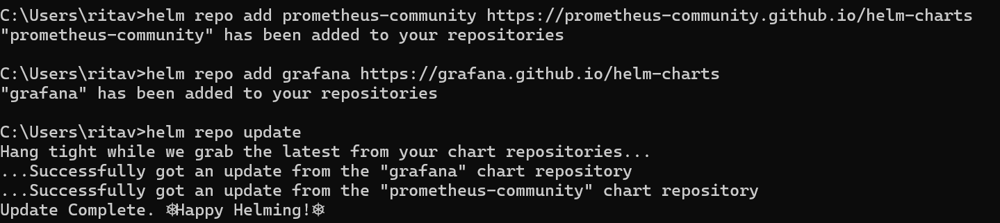

Создадим отдельный неймспейс (так как мы умные котики, и знаем, что такое наймспейс и как это важно) для мониторинга:
```
kubectl create namespace monitoring
```

После с помощью команд:

```
helm install prometheus prometheus-community/prometheus --namespace monitoring
```

```
helm install grafana grafana/grafana --namespace monitoring
```

1. Установим Prometheus:

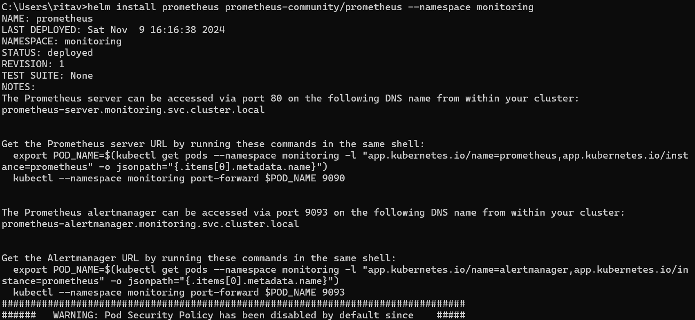

2. Установим Grafana:

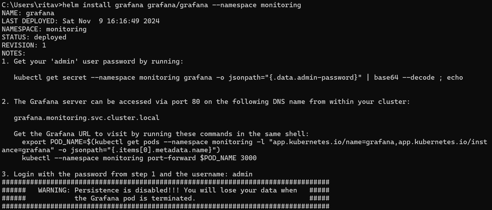

Проверить успешность установки:

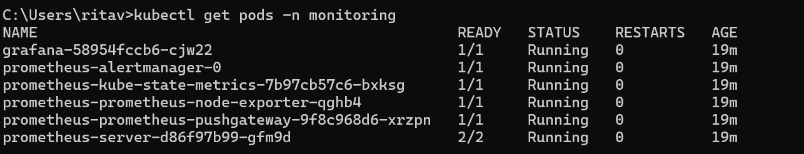

Ура! Всё стоит и вроде как работает, а теперь главное сделать всё так, чтобы оно не упало и реально работало! 

### Настройка сервиса (могучего и ужасного) Prometheus

Настроим сервис для мониторинга Prometheus. 

Prometheus должен знать, что наш сервис можно мониторить, поэтому добавим аннотации к YAML-файлу сервиса:


Эти аннотации указывают Prometheus, что сервис доступен для сбора метрик и что он может начинать пахать!

### Вход в Grafana

Чтобы получить пароль администратора Grafana, выполним команду, предложенную в первом разделе при установке Grafana:

```
kubectl get secret --namespace monitoring grafana -o jsonpath="{.data.admin-password}" | base64 --decode ; echo
```

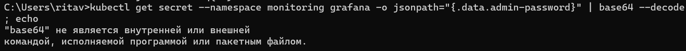

Однако вместо пароля мы увидели типичное неуважение создателей серверного программного обеспечения к пользователям операционной системы Windows, так как для них команда base64 недоступна в командной строке.

Поэтому мы просто получим admin-password, закодированный в base64, и расшифруем его вручную, используя онлайн-декодер:

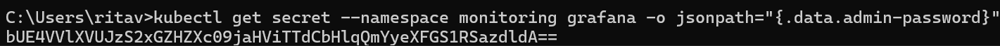

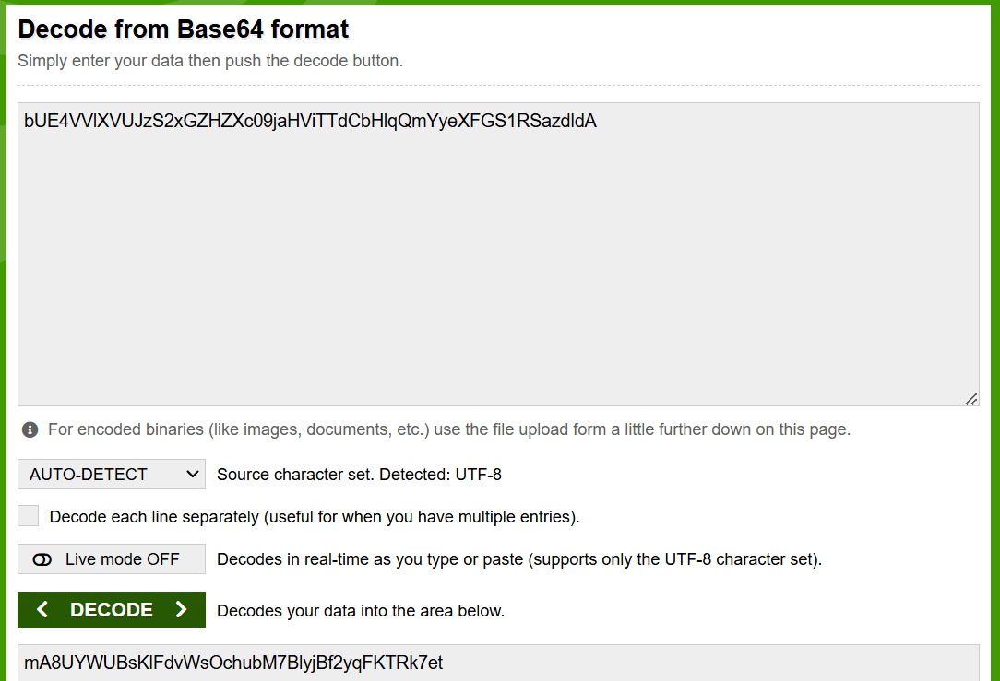

> P.S
> 
> Лучше всего не показывать свои секреты и хранить их в надёжном месте, например в Hash Vault (спасибо, четвёртой лабораторной работе), но для лабораторной можно и спалить, тем более что вы мне сделаете? У меня сервер на localhost!

После этого откроем браузер и перейдём по адресу http://localhost:3000, используя учетные данные 
(имя пользователя по умолчанию: admin, получение пароля представлено выше), попадаем в Grafana.


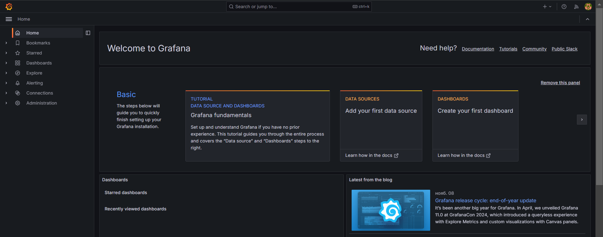

Ура! Мы в системе! Можно открывать курсы по взлому Grafana!

### Создание (не более двух) графиков

Добавим источник данных Prometheus, для этого:
1. Заходим в Connections -> Data sources
2. Добавляем новый источник с типом Prometheus
3. Указываем URL-адрес Prometheus-сервера: http://prometheus-service.monitoring.svc.cluster.local:80 (если что этот адрес был показан на моменте установки Prometheus).
4. Пьём успокоительный чай (пока всё хорошо, но кто знает, что может пойти не так и что может быть в части со звёздочкой - готовимся заранее)

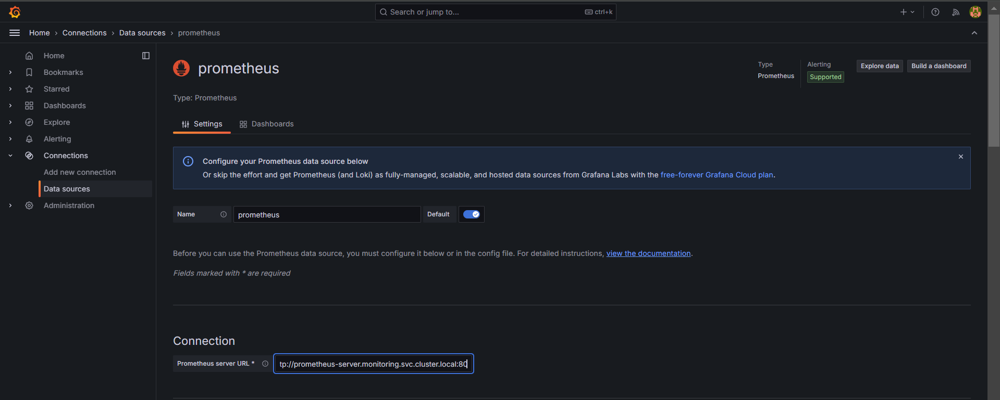

Теперь в разделе дэшбордов можно создавать дэшборды (удивительно, не правда ли!), чтобы наблюдать метрики сервиса с помощью PromQL-запросов.

<details>

<summary>PromQL</summary>

PromQL (Prometheus Query Language) - язык запросов для системы мониторинга Prometheus. Он позволяет извлекать, фильтровать и агрегировать метрики, чтобы получить информацию о производительности и статусе систем.

Позволяет:
- Выбирать конкретные метрики по имени и меткам.
- Фильтровать метрики по значениям меток и временным интервалам.
- Агрегировать метрики (например, суммировать, вычислять среднее значение).
- Использовать арифметические операции и логические операторы.
- Использовать встроенные функции (например, rate(), irate(), increase(), quantile()).

В общем, если когда-то работали с SQL-запросами, то здесь почти ничего нового по логике - нет, только по синтаксису.

</details>

На рисунке ниже представлено создание запроса, который показывает текущее потребление памяти подами в байтах.
```
sum(container_memory_usage_bytes{namespace="default"}) by (pod)
```
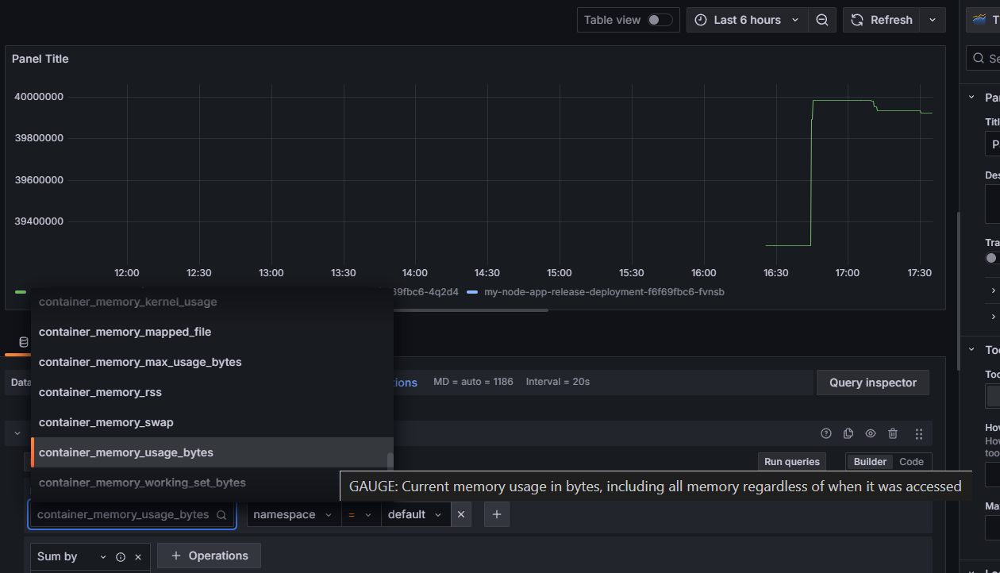

> P.S
> 
> Как видно графический интерфейс даёт возможность создания простых запросов, что удобно. Однако, чтобы создать что-то более сложное, придётся думать самому...

Второй график показывает среднее потребление CPU для каждого пода в namespace default, усреднённое за последние 5 минут. Это значение измеряется в "долях процессора в секунду" (например, 0.5 означает использование 50% одного процессорного ядра).
```
sum(rate(container_cpu_usage_seconds_total{namespace="default"}[5m])) by (pod)
```
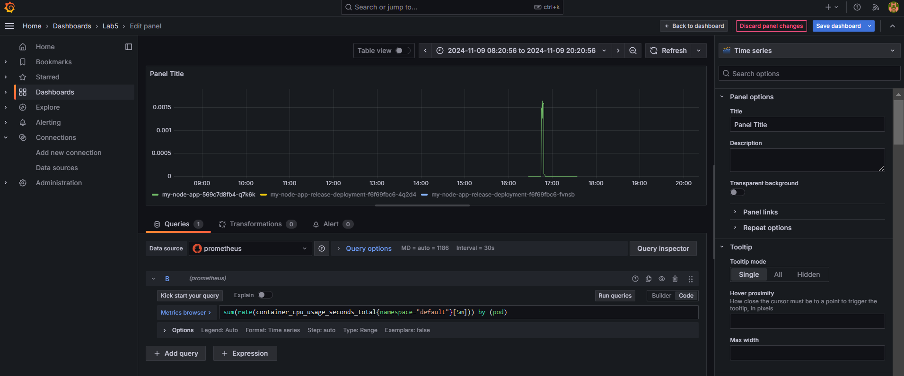

Оба графика, без лишней мишуры, можно глянуть в разделе Дэшбордов:
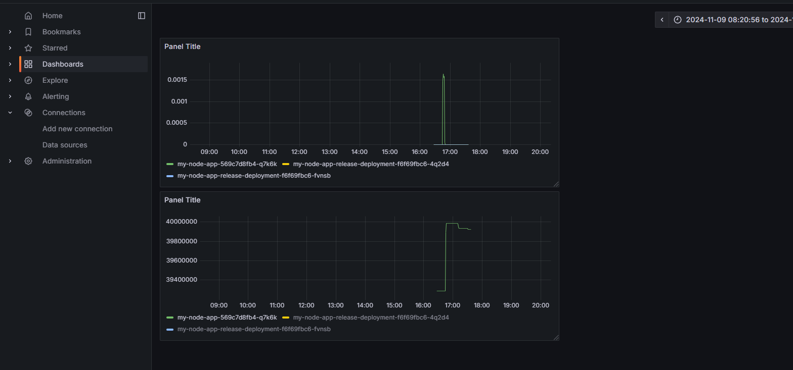

> P.S.
>
> Над отображением графиков конечно стоило бы поработать, а то непонятно, чего это за графики, что это за зелёная линия... Но к моменту написания отчёта, всё уже было уничтожено. В следующий раз обязательно сделаем красиво!

## Вывод

В ходе лабораторной работы нам удалось подключить систему мониторинга за сервисом, запущенным внутри Kubernetes, с помощью Prometheus, и даже смогли вывести два очень красивых графика с помощью Grafana. Самое классное было увидеть, что графики действительно появились, а значит нам удалось достигнуть цели поставленной в конце первого раздела: "оно не упало и реально работало". А главное без серьёзных происшествий, ждём, что будет в звёздочке!
