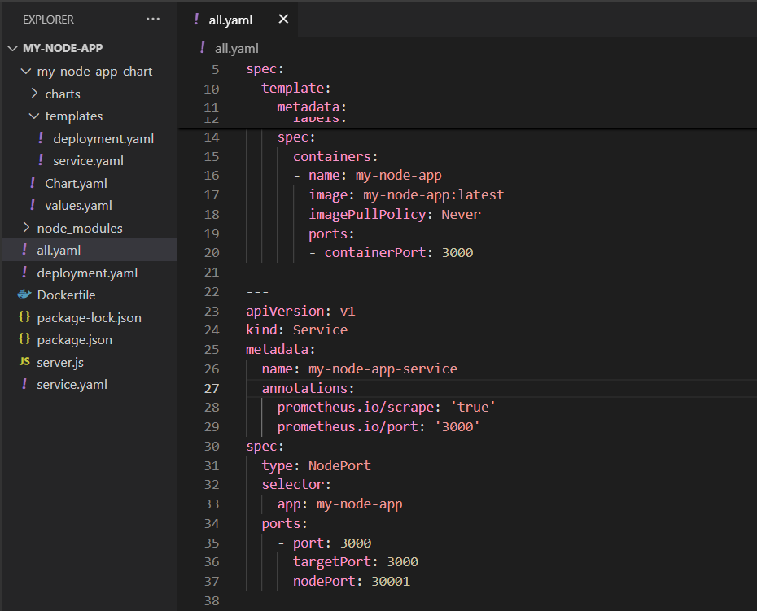

1.
С помощью Helm установим Prometheus и Grafana. Выполним следующие команды для установки в нашем кластере:


Создадим отдельный неймспейс для мониторинга:
```
kubectl create namespace monitoring
```

Установим Prometheus


Установим Grafana


Проверить успешность установки можно так


2.
Настроим сервис для мониторинга Prometheus. Prometheus должен знать, что наш сервис можно мониторить, поэтому добавим аннотации к YAML-файлу сервиса
Эти аннотации указывают Prometheus, что сервис доступен для сбора метрик.


3. Вход в Grafana

Чтобы получить пароль администратора Grafana, выполним команду, предложенную в первом пункте при установке Grafana, 
но  команда base64 недоступна в командной строке Windows. Поэтому мы получили admin-password, закодированный в base64, и расшифровали его вручную, используя онлайн-декодер


После этого откроим браузер и перейдем по адресу http://localhost:3000, используя учетные данные 
(имя пользователя по умолчанию: admin, получение пароля представлено выше).


4. Создание графиков

Добавим источник данных Prometheus, для этого в Connections -> Data sources добавим новый источник с типом Prometheus 
и укажем URL-адрес Prometheus-сервера (http://prometheus-service.monitoring.svc.cluster.local:80).


Теперь мы можем создать дашборды, чтобы наблюдать метрики сервиса с помощью PromQL-запросов.
На рисунке ниже представно создание запроса, который показывает текущее потребление памяти подами в байтах.
```
sum(container_memory_usage_bytes{namespace="default"}) by (pod)
```


Второй график показывает среднее потребление CPU для каждого пода в namespace default, усреднённое за последние 5 минут. Это значение измеряется в "долях процессора в секунду" (например, 0.5 означает использование 50% одного процессорного ядра).
```
sum(rate(container_cpu_usage_seconds_total{namespace="default"}[5m])) by (pod)
```


Оба графика можно посмотреть в разделе Дашборды.

