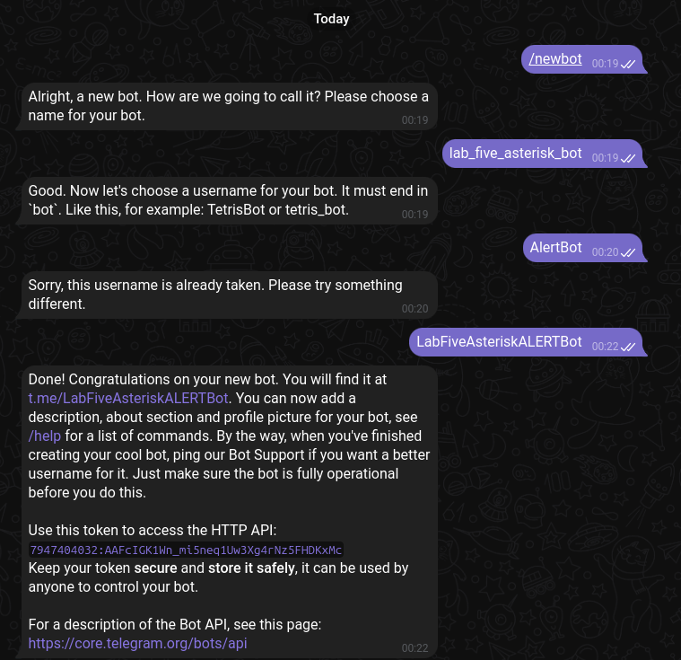
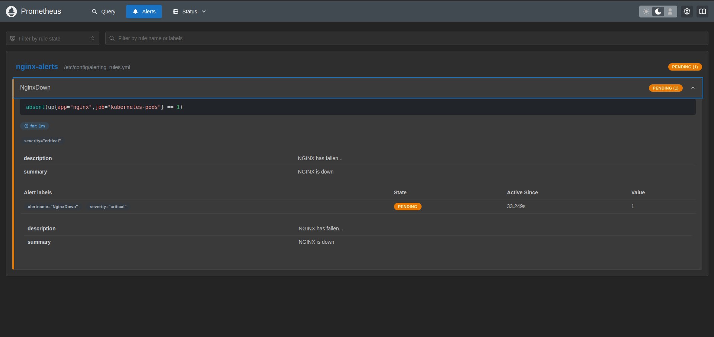
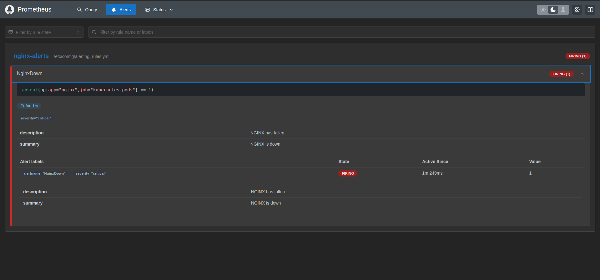
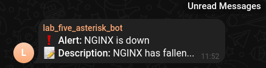

# Лабораторная работа №5*(со звездочкой)

## Цель

Настроить алерт кодом IaaC (например через конфиг алертменеджера, главное - не в интерфейсе графаны:), показать пример его срабатывания. 
Попробовать сделать так, чтобы он приходил, например, на почту или в телеграм

## Выполнение работы

### Создание бота



Создали бота и получили токен с помощью `BotFather`.<br>
Далее с помощью метода `getUpdates` получили id группы, куда бот был предварительно добавлен.

### Настройка алерта

Развернули в кубере Nginx.

<details>
  <summary>nginx-deployment.yaml</summary>
  
  ```
apiVersion: apps/v1
kind: Deployment
metadata:
  name: nginx-deployment
spec:
  replicas: 2
  selector:
    matchLabels:
      app: nginx
  template:
    metadata:
      labels:
        app: nginx
    spec:
      containers:
      - name: nginx
        image: nginx:1.14.2
        ports:
        - containerPort: 80
```
</details>

<details>
  <summary>nginx-service.yaml</summary>
  
  ```
apiVersion: v1
kind: Service
metadata:
  name: nginx-service
spec:
  selector:
    app: nginx
  ports:
  - protocol: TCP
    port: 80
    targetPort: 80
  type: NodePort
```
</details>

После этого `prometheus` и `grafana` были установлены в предварительно созданное пространство имен `monitoring` с помощью команд:

```
helm install prometheus prometheus-community/prometheus -n monitoring
```

```
helm install grafana grafana/grafana -n monitoring
```

Далее с помощью `scrape-config` сделали так, чтобы `prometheus` каждые 15 сек проверял, жив ли наш под.

<details>
  <summary>scrape-config.yaml</summary>

  ```
global:
  scrape_interval: 15s

scrape_configs:
  - job_name: 'kubernetes-pods'
    kubernetes_sd_configs:
    - role: pod
    relabel_configs:
    - source_labels: [__meta_kubernetes_pod_label_app]
      action: keep
      regex: nginx
```
</details>

Ну и самое главное - alert: указали, куда что и при каких условиях отправлять.

<details>
  <summary>alert.yaml</summary>

  ```
alertmanager:
  config:
    global:
      resolve_timeout: 1m
      telegram_api_url: "https://api.telegram.org"

    route:
      receiver: telegram

    receivers:
      - name: telegram
        telegram_configs:
          - chat_id: id
            bot_token: token
            api_url: "https://api.telegram.org"
            send_resolved: true
            parse_mode: Markdown
            message: |-
              {{ range .Alerts }}
                ❗ *Alert:* {{ .Annotations.summary }}
                📝 *Description:* {{ .Annotations.description }}
              {{ end }}

serverFiles:
  alerting_rules.yml:
    groups:
      - name: nginx-alerts
        rules:
          - alert: NginxDown
            expr: absent(up{job="kubernetes-pods", app="nginx"} == 1)
            for: 1m
            labels:
              severity: critical
            annotations:
              summary: "NGINX is down"
              description: "NGINX has fallen..."
```
</details>

Далее необходимо обновить `values.yaml` с помощью команд:

```
helm upgrade prometheus prometheus-community/prometheus -n monitoring -f scrape-config.yaml
```

```
helm upgrade prometheus prometheus-community/prometheus -n monitoring -f alert.yaml
```

Перейдя в графический интерфейс увидели наш алерт сначала в состоянии `Pending`, а затем `Firing`.




И через некоторое время `message` в `Telegram`.



## Вывод

В результате выполнения работы были рассмотрен процесс создания алертов через конфиг алертменеджера.
